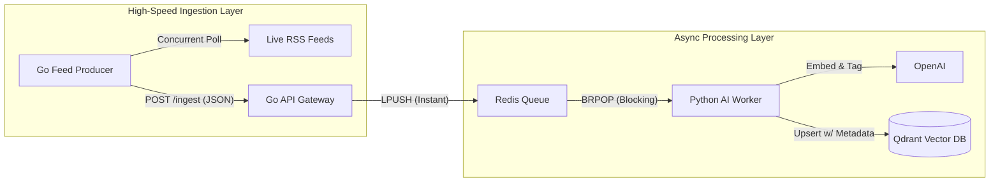

# MarketPulse Engine: High-Throughput Financial Intelligence

> **The Technical Challenge:** Standard RAG applications are synchronous. If a user uploads 50 documents (e.g., 10-K filings) or connects a live news feed, the web server hangs while waiting for embeddings, leading to timeouts (504 Errors) and crashes under load.
> 
> **The Solution:** MarketPulse is an **Asynchronous RAG Engine**. It separates ingestion from processing using a **Go** microservices architecture and a **Redis** buffer, allowing it to ingest massive financial datasets instantly while a **Python** brain processes them in the background.

---

## 🏗 Architecture

The system is designed to handle **burst traffic** (like Earnings Season) without dropping requests.



### Core Components

| Service | Tech Stack | Role | Why this tech? |
| --- | --- | --- | --- |
| **The Producer** | **Go (Goroutines)** | Aggregation | Polls dozens of financial feeds simultaneously. Far more efficient than a synchronous Python loop. |
| **The Gateway** | **Go (Fiber)** | Ingestion | Handles 10k+ concurrent requests/sec. Eliminates the "GIL" bottleneck of Python servers. |
| **The Buffer** | **Redis** | Message Queue | Acts as a "Shock Absorber." If OpenAI latency spikes, the queue grows, but the server stays up. |
| **The Brain** | **Python 3.12** | Semantic Processing | Uses `uv` for fast dependency management. Handles the complex financial logic (Chunking/Embedding). |
| **The Memory** | **Qdrant** | Vector Database | Stores vectors with **Metadata Passports** (Region, Topic) for surgical retrieval. |

---

## 💼 The Business Case: "The Wisdom & The Wire"

I applied this architecture to solve a critical problem in FinTech: **Information Overload.**

* **The Problem:** Financial analysts cannot process real-time news ("The Wire") and cross-reference it with deep fundamental strategy ("The Wisdom") without latency or hallucination.
* **The Implementation:**
* **The Wire:** A dedicated Go service constantly polls live RSS/News feeds and fires them at the Gateway.
* **The Wisdom:** A Python pipeline indexes static PDFs (e.g., *The Intelligent Investor*).
* **The Result:** A system that can answer: *"Based on Benjamin Graham's principles, how should I react to today's inflation news?"*


---

## 🚀 Key Features

* **Goroutine Concurrency:** Replaced standard Python pollers with Go microservices to fetch market data in parallel.
* **Non-Blocking I/O:** The Go Gateway acknowledges data receipt in microseconds (`202 Accepted`), preventing client timeouts during large file uploads.
* **Metadata Passporting:** Every document is tagged with `region` (US/India) and `topic`. The AI knows not to apply US Tax Law to Indian Stocks.
* **Smart Chunking:** Uses context-aware splitters (RecursiveCharacter) to keep financial concepts intact across page breaks.
* **Dockerized:** Entire stack spins up with a single compose command.

---

## 🛠️ Getting Started

### Prerequisites

* Docker & Docker Compose
* OpenAI API Key

### Installation

1. **Clone the repository**

```bash
git clone [https://github.com/onslaught7/market-pulse-engine.git](https://github.com/onslaught7/market-pulse-engine.git)
cd market-pulse-engine

```

2. **Set Environment Variables**
Create a `.env` file in the root:

```env
OPENAI_API_KEY=sk-your-key-here

```

3. **Launch the System**

```bash
docker-compose up --build

```

---

## ⚡ Usage

### 1. Watch "The Wire" in Action

Once Docker Compose is running, the **Go Producer** automatically starts fetching live financial news and hitting the Gateway. Watch the logs:

```bash
docker logs -f vortex-producer

```

**Response:**

```text
[*] Starting Go Feed Producer (The Wire)...
--- Polling 3 Feeds ---
 [v] Sent: Bitcoin rallies to new highs...
 [v] Sent: S&P 500 futures dip ahead of...

```

### 2. Check the Worker Logs

The Python worker picks up the tasks from Redis asynchronously:

```bash
docker logs -f vortex-worker

```

```text
[Worker] Processing news_2024...
[Worker] Type: 'news' | Region: 'global'
[Worker] Indexed in 'wire' collection. Time: 0.4s

```

---

## 🧠 Engineering Decisions

**Why separate the Producer and Gateway into two Go services?**
Separation of Concerns. The Gateway should be a "dumb" highly-available pipe that just accepts data and queues it. The Producer handles the messy logic of XML parsing and external HTTP timeouts. If a news site goes down and hangs the Producer, the Gateway stays perfectly healthy to accept manual uploads.

**Why Qdrant instead of Pinecone?**
We need **Metadata Filtering** ("Show me only Indian stocks") to prevent the AI from hallucinating across markets. Qdrant's payload filtering is blazing fast and runs locally in Docker, allowing for a fully self-hosted stack.

---

## 📜 License

MIT

```

---