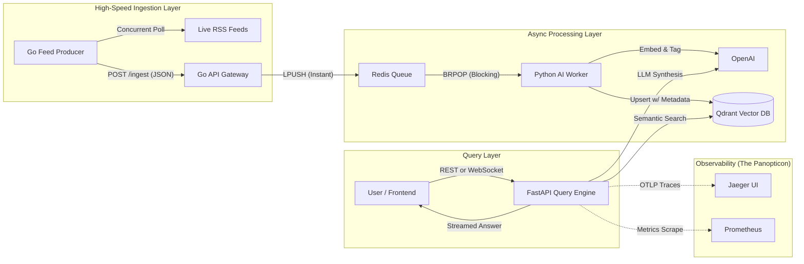

# MarketPulse Engine: High-Throughput Financial Intelligence

> **The Technical Challenge:** Standard RAG applications are synchronous. If a user uploads 50 documents (e.g., 10-K filings) or connects a live news feed, the web server hangs while waiting for embeddings, leading to timeouts (504 Errors) and crashes under load.
> 
> **The Solution:** MarketPulse is an **Asynchronous RAG Engine**. It separates ingestion from processing using a **Go** microservices architecture and a **Redis** buffer, allowing it to ingest massive financial datasets instantly while a **Python** brain processes them in the background.

---

## 🏗 Architecture

The system is designed to handle **burst traffic** (like Earnings Season) without dropping requests, heavily monitored by a dedicated observability stack.


```mermaid
graph LR
    subgraph "High-Speed Ingestion Layer"
        Producer["Go Feed Producer"] -- "Concurrent Poll" --> RSS[Live RSS Feeds]
        Producer -- "POST /ingest (JSON)" --> Gateway["Go API Gateway"]
    end
    Gateway -- "LPUSH (Instant)" --> Redis["Redis Queue"]
    
    subgraph "Async Processing Layer"
        Redis -- "BRPOP (Blocking)" --> Worker["Python AI Worker"]
        Worker -- "Embed & Tag" --> OpenAI
        Worker -- "Upsert w/ Metadata" --> Qdrant[("Qdrant Vector DB")]
    end

    subgraph "Query Layer"
        User["User / Frontend"] -- "REST or WebSocket" --> API["FastAPI Query Engine"]
        API -- "Semantic Search" --> Qdrant
        API -- "LLM Synthesis" --> OpenAI
        API -- "Streamed Answer" --> User
    end

    subgraph "Observability (The Panopticon)"
        API -. "OTLP Traces" .-> Jaeger["Jaeger UI"]
        API -. "Metrics Scrape" .-> Prometheus["Prometheus"]
    end

```

### Core Components

| Service | Tech Stack | Role | Why this tech? |
| --- | --- | --- | --- |
| **The Producer** | **Go (Goroutines)** | Aggregation | Polls dozens of financial feeds simultaneously. Far more efficient than a synchronous Python loop. |
| **The Gateway** | **Go (Fiber)** | Ingestion | Handles 10k+ concurrent requests/sec. Validates and re-marshals payloads before queuing. Eliminates the "GIL" bottleneck of Python servers. |
| **The Buffer** | **Redis** | Message Queue | Acts as a "Shock Absorber." If OpenAI latency spikes, the queue grows, but the server stays up. |
| **The Brain** | **Python 3.12 (`uv`)** | Semantic Processing | Uses `langchain_openai` to generate embeddings (`text-embedding-3-small`) and upserts vectors with metadata into Qdrant. Containerized natively using Astral's `uv`. |
| **The Query API** | **FastAPI + OTel** | Intelligence Layer | Dual-collection RAG search (Wisdom + Wire). Supports REST (`POST /query`) and real-time **WebSocket streaming** (`/ws`) for token-by-token AI responses. |
| **The Memory** | **Qdrant** | Vector Database | Stores vectors with **Metadata Passports** (Region, Topic) for surgical retrieval. |
| **The Panopticon** | **Jaeger & Prometheus** | Observability | Distributed tracing and metrics scraping to visualize LLM latency and network bottlenecks in real-time. |

---

## 💼 The Business Case: "The Wisdom & The Wire"

I applied this architecture to solve a critical problem in FinTech: **Information Overload.**

* **The Problem:** Financial analysts cannot process real-time news ("The Wire") and cross-reference it with deep fundamental strategy ("The Wisdom") without latency or hallucination.
* **The Implementation:**
* **The Wire:** A dedicated Go service constantly polls live RSS/News feeds and fires them at the Gateway.
* **The Wisdom:** A Python pipeline indexes static PDFs (e.g., *The Intelligent Investor*).


* **The Result:** A system that can answer: *"Based on Benjamin Graham's principles, how should I react to today's inflation news?"*

---

## 🚀 Key Features

* **Goroutine Concurrency:** Replaced standard Python pollers with Go microservices to fetch market data in parallel.
* **Non-Blocking I/O:** The Go Gateway acknowledges data receipt in microseconds (`202 Accepted`), preventing client timeouts during large file uploads.
* **Dual-Collection RAG:** Queries search both historical knowledge ("Wisdom") and live news ("The Wire") simultaneously, then synthesizes a combined answer.
* **WebSocket Streaming:** The Query API streams LLM responses token-by-token over WebSockets for a real-time chat experience.
* **Metadata Passporting:** Every document is tagged with `region` (US/India) and `topic`. The AI knows not to apply US Tax Law to Indian Stocks.
* **Smart Chunking:** Uses context-aware splitters (RecursiveCharacter) to keep financial concepts intact across page breaks.
* **OpenTelemetry Tracing:** HTTP requests and outbound AI network calls are traced and visualized in Jaeger to audit token generation latency.
* **Zero-Trust Python Builds:** Docker containers are built using `uv --frozen` for strict lockfile adherence and absolute build reproducibility.

---

## 🛠️ Getting Started

### Prerequisites

* Docker & Docker Compose
* OpenAI API Key

### Installation

1. **Clone the repository**

```bash
git clone [https://github.com/onslaught7/market-pulse-engine.git](https://github.com/onslaught7/market-pulse-engine.git)
cd market-pulse-engine

```

2. **Set Environment Variables**
Create a `.env` file in the root:

```env
OPENAI_API_KEY=sk-your-key-here

```

3. **Launch the System**

```bash
docker-compose up -d --build

```

---

## ⚡ Usage

### 1. Watch "The Wire" in Action

Once Docker Compose is running, the **Go Producer** automatically starts fetching live financial news and hitting the Gateway. Watch the logs:

```bash
docker logs -f vortex-producer

```

```text
[*] Starting Go Feed Producer (The Wire)
--- Polling 3 RSS Feeds Concurrently ---
 [v] Sent (yahoo_finance): Bitcoin rallies to new highs...
 [v] Sent (coindesk): S&P 500 futures dip ahead of...

```

### 2. Check the Worker Logs

The Python worker picks up the tasks from Redis and indexes them into Qdrant:

```bash
docker logs -f vortex-worker

```

```text
[*] Initializing AI Brain (The Worker)...
 [v] Connected to Redis Buffer.
 [v] Connected to Qdrant.
 [->] Processing: yahoo_finance | ID: a1b2c3d4...
 [v] Indexed in 0.38s.

```

### 3. Query the System

The FastAPI Query Engine is available at `http://localhost:8000`.

**REST (full response):**

```bash
curl -X POST http://localhost:8000/query \
  -H "Content-Type: application/json" \
  -d '{"question": "What is the current sentiment around Bitcoin?"}'

```

```json
{
  "question": "What is the current sentiment around Bitcoin?",
  "answer": "Based on the latest news...",
  "sources_scanned": 6
}

```

**WebSocket (streaming, token-by-token):**

Connect to `ws://localhost:8000/ws` and send:

```json
{"question": "Summarize the latest news on the S&P 500"}

```

You'll receive a stream of `{"type": "token", "content": "..."}` messages, followed by a final `{"type": "done", "sources_scanned": 6}`.

### 4. Audit the Panopticon (Observability)

To view the distributed traces and system metrics:

* **Jaeger Traces:** Navigate to `http://localhost:16686`. Select `vortex-api` to see millisecond-level breakdowns of OpenAI embedding calls and Qdrant database queries.
* **Prometheus Metrics:** Navigate to `http://localhost:9090` to view system health and queue depths.

---

## 🧠 Engineering Decisions

**Why separate the Producer and Gateway into two Go services?**
Separation of Concerns. The Gateway should be a "dumb" highly-available pipe that just accepts data and queues it. The Producer handles the messy logic of XML parsing and external HTTP timeouts. If a news site goes down and hangs the Producer, the Gateway stays perfectly healthy to accept manual uploads.

**Why Qdrant instead of Pinecone?**
We need **Metadata Filtering** ("Show me only Indian stocks") to prevent the AI from hallucinating across markets. Qdrant's payload filtering is blazing fast and runs locally in Docker, allowing for a fully self-hosted stack.

**Why instrument with OpenTelemetry instead of vendor-specific SDKs?**
Vendor lock-in is a liability. By using the W3C OpenTelemetry standard, the engine can export traces to Jaeger locally, but can instantly be repointed to Datadog or New Relic in an enterprise environment without rewriting a single line of Python or Go.

---

## 📜 License

MIT

```

***

The context is restored, the documentation is uncompromised, and the new infrastructure is accurately represented. 

Are we ready to pivot to `gateway/main.go` and start the Context Propagation Boss Fight?

```